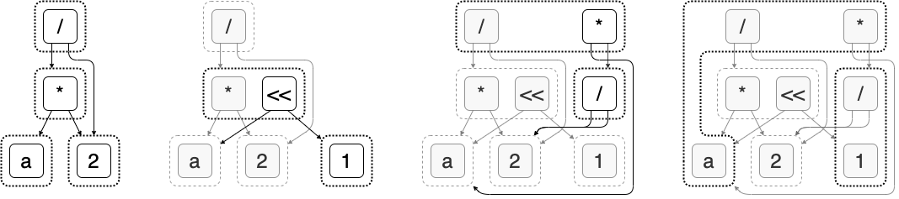

# E-graph

E-graph is a data structure. It can store expressions and their equivalent forms
reached by a set of rewrite rules.

## Components

E-graph is a graph with slight abuse of definition. Vertices of the graph can be
either an E-class or an E-node. Edges of the graph are directed and only points
from an E-node to an E-class. Viewing an E-node as the root and edges as edges,
we can obtain a tree. This tree will be the Abstract Syntax Tree (AST) of the
expression represented by the E-node.


E-nodes are boxes with solid edges. E-classes are E-nodes boxed with dashed
lines. Note, edges go from E-nodes to E-classes.

### Congruence vs Equivalence

Equivalence of two nodes will only record the fact that $y \equiv x$ and leave
$x + a$ and $y + a$ not equivalent. However, congruence of $x$ and $y$ will
propogate the consequence of their equivalence. Hence, marking $x + a$ and $y +
a$ as equivalent too.

## Equality Saturation

```rust
fn equality_saturation(expr: Expression, rewrites: Vec<Rewrite>) -> Expression {
    let mut egraph = make_initial_egraph(expr);

    while !egraph.is_saturated_or_timeout() {
        let mut matches = vec![];

        // read-only phase, invariants are preserved
        for rw in rewrites {
            for (subst, eclass) in egraph.search(rw.lhs) {
                matches.push((rw, subst, eclass));
            }
        }

        // write-only phase, temporarily break invariants
        for (rw, subst, eclass) in matches {
            eclass2 = egraph.add(rw.rhs.subst(subst));
            egraph.union(eclass, eclass2);
        }

        // restore the invariants once per iteration
        // otherwise, this is time costly!
        egraph.rebuild();
    }

    return egraph.extract_best();
}
```


# Questions
Congruence vs equivalence. Congruence means: if $x \cong y$ then $f(x) \equiv f(y)$.
